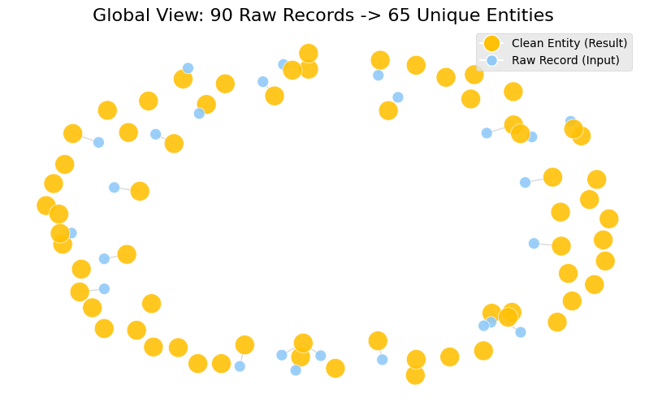
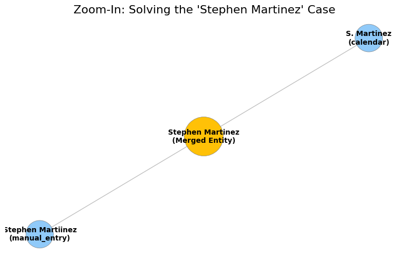

# AI-Powered CRM Entity Resolver


A production-ready entity resolution pipeline using **Gemini 2.0 Flash-Lite** to deduplicate ambiguous customer records (nicknames, typos, job changes) where rule-based systems fail.

## Executive Summary
Tested on a high-noise synthetic dataset (N=90) containing aggressive edge cases.

| Metric | Rule-Based Baseline | This Project (Gemini 2.0) |
|:---:|:---:|:---:|
| **F1 Score** | 14.04% | **96.08%** |
| **Precision** | 100% | **100%** |
| **Recall** | 8% | **92.45%** |
| **Reduction** | - | **28%** (90 records → 65 unique) |
| **Cost** | - | **<$0.50** (API Usage) |

> **Key Takeaway:** Achieved **100% Precision** (Zero False Positives), prioritizing data safety while delivering an **82% lift** in F1 score over baseline methods.

## Visualization

### 1. Macro View (Global Reduction)
Distinct clusters demonstrate effective separation of identities without over-merging.



### 2. Micro View (Complex Merge Case)
Resolving a **Typo** ("Martiinez") + **Nickname** ("S. Martinez") + **Job Change** into a single canonical entity.



## Engineering Decisions

### Why LLM over Microservices?
Standard deterministic algorithms (Levenshtein, Jaro-Winkler) fail on semantic ambiguity.

* **Contextual Reasoning:** Unlike rigid string matching, the LLM uses context (Email Domain, Job Title, generic vs. specific names) to resolve identities with high confidence.
* **Zero-Shot Adaptation:** Instantly handles novel data patterns via prompt engineering without retraining complex rule sets.
* **Auditable Decisions:** Acts as a "Cynical Auditor," providing natural language reasoning for every merge decision rather than opaque similarity scores.

### Dataset Strategy
Utilized a high-density synthetic dataset (N=90) heavily weighted with edge cases (>50% noise) to stress-test logic rapidly. This approach ensured verifiable **100% Precision** ground-truthing while minimizing API costs during iteration.

### Architecture & Scalability
Currently optimizes search space via **Blocking** (grouping by key attributes), reducing complexity from O(N²) to near-linear.

**Scaling Path to 1M+ Records:**
1.  **Vector Search (RAG):** Migrate blocking to **HNSW (Hierarchical Navigable Small World)** using lightweight embeddings for O(log N) candidate retrieval before LLM verification.
2.  **Distributed Processing:** The stateless, modular `Pipeline` design allows for containerized, parallel batch processing via Kubernetes or Ray.

## Code Quality Signals
* **Modular Design:** Decoupled logic into `EntityResolver` (LLM interactions), `MergeStrategy` (Data unification), and `Pipeline` (Orchestration).
* **Provenance Tracking:** Maintains a full audit trail of source records within every merged entity.
* **Evaluation Framework:** Automated script for calculating Precision/Recall against ground truth labels.

## Quick Start

**1. Clone the repository**
```bash
git clone [https://github.com/buvanipai/crm-entity-resolver.git](https://github.com/buvanipai/crm-entity-resolver.git)
cd crm-entity-resolver
````

**2. Install dependencies**

```bash
pip install -r requirements.txt
```

**3. Set up API Key**
Create a `.env` file in the root directory:

```bash
GEMINI_API_KEY=your_api_key_here
```

**4. Run the Pipeline**

```bash
python src/pipeline.py
```

## Reproducibility
The metrics in this report are not hardcoded. You can re-run the evaluation framework to verify the 100% Precision and 96% F1 Score against the labeled ground truth dataset.

```bash
python src/evaluator.py